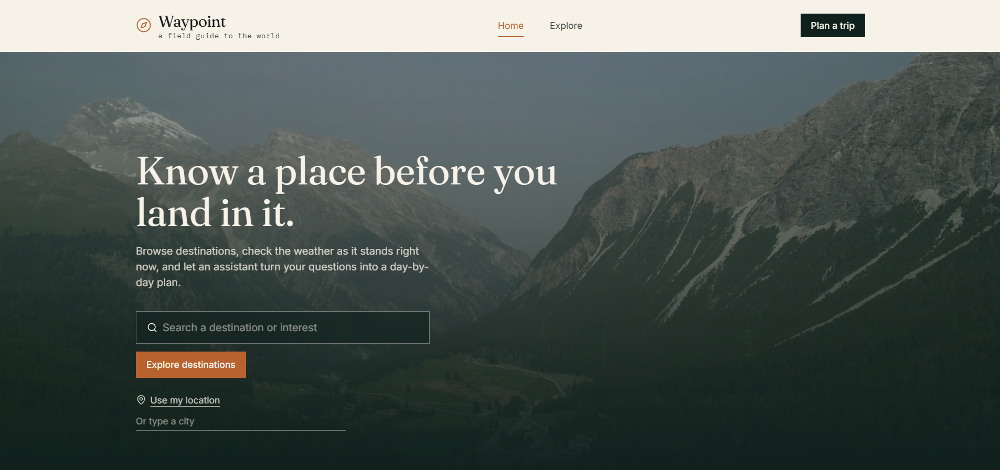
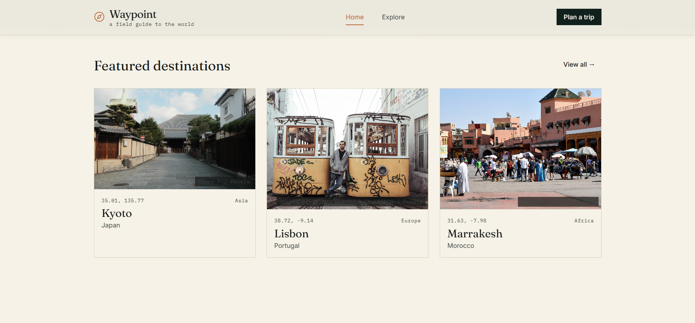
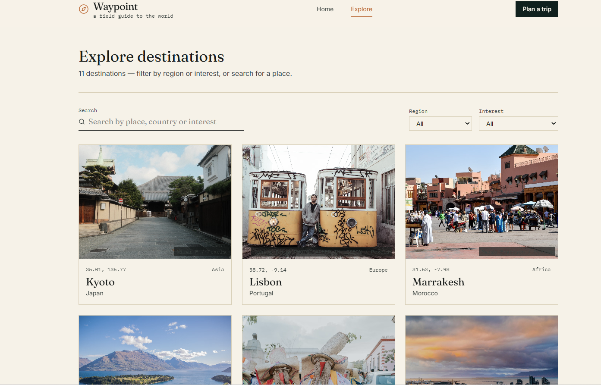
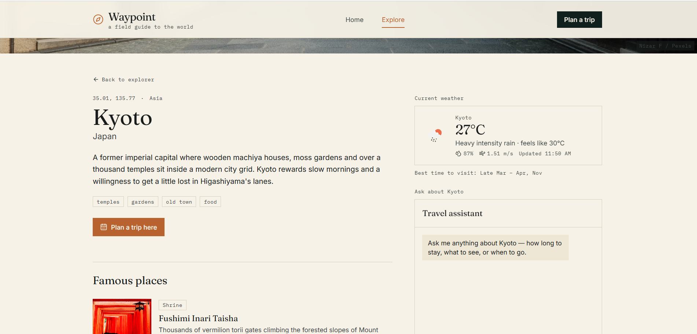
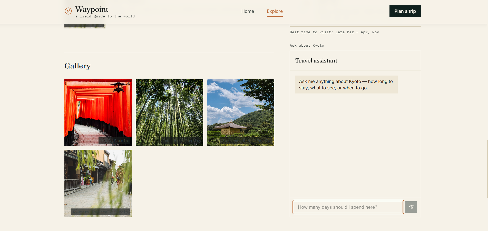
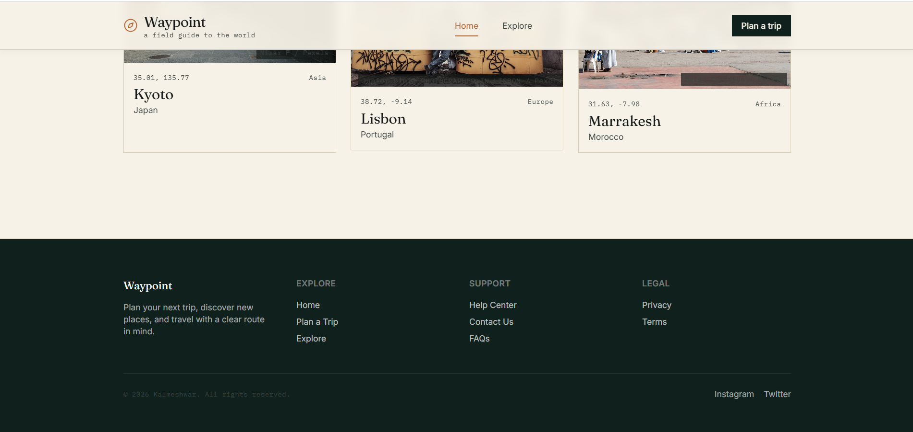
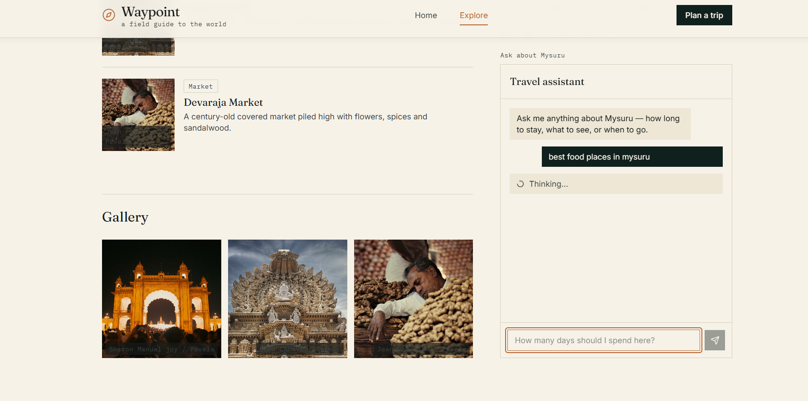
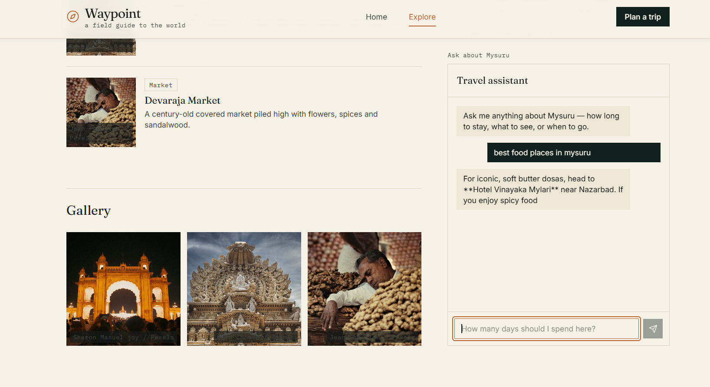
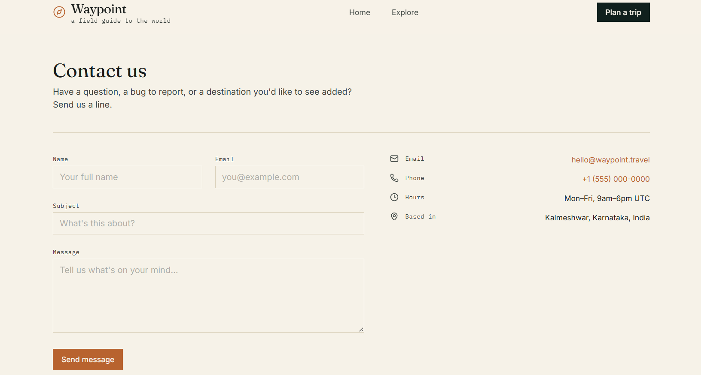

# Waypoint — Travel Explorer


## Features

- **Landing hero** — full-bleed looping background video with a search entry
  point into the explorer.
- **Destination explorer** — search and filter by region or interest;
  destination cards link to a dedicated details page.
- **Destination details** — overview, famous places (image + category +
  description, not a bare list), a photo gallery, live weather, and a
  destination-aware AI chat panel.
- **Location awareness** — asks for the visitor's location once; if denied or
  unavailable, a manual city search (geocoding) is always available so the
  app is never blocked on permission.
- **Live weather** — current conditions (temperature, feels-like, humidity,
  wind) via OpenWeather, with skeleton and error states.
- **Dynamic images** — every photo is fetched at render time from
  Unsplash (with a Pexels fallback), never hardcoded into the project.
- **AI travel assistant** — a Gemini-backed chat panel, scoped to the open
  destination, for questions like "how many days should I spend here?".
- **Itinerary planning** — a form (days, pace, budget, interests) that asks
  Gemini for strict JSON, validates it with Zod before rendering, and
  displays it as a real day-by-day timeline, never as a block of chat text.
- **Designed failure states** — every external call (weather, images, AI,
  geolocation, geocoding) has its own loading skeleton, empty state, and
  error/retry state.
- **Accessibility** — semantic landmarks, a skip-to-content link, visible
  keyboard focus throughout, labeled form controls, Escape-to-close on the
  mobile chat drawer, and prefers-reduced-motion support.
- **Responsive** — from a phone up to a large desktop screen.

## APIs used

| Purpose      | Provider                          |
| ------------ | ---------------------------------- |
| Weather      | OpenWeather — Current Weather + Geocoding |
| Images       | Unsplash (Pexels as fallback) |
| AI assistant | Google Gemini (gemini-2.5-flash) |
| Video        | Coverr (hero background) |

All destination/place data (names, descriptions, coordinates) is a small
curated dataset in `src/data/destinations.js` — only imagery and live weather
are fetched from external services, as the assignment asks.

## Tech stack

React 19 + Vite, React Router, TanStack Query (server-state caching &
retries), Zustand (location/UI state), React Hook Form + Zod (validated
forms and AI-output validation), Tailwind CSS v4, Lucide icons.

## Project structure

```
src/
  app/            router, root layout, providers
  pages/          Home, Destinations, DestinationDetails, Itinerary, NotFound
  components/     layout, destination, weather, chatbot, itinerary, common
  services/       weatherApi, geocodingApi, imageApi, geminiApi (thin, normalized)
  hooks/          useGeolocation, useWeather, useLocationSearch, useDestinations, ...
  store/          zustand travelStore (active location)
  schemas/        zod schemas -- itinerary form + AI output validation
  data/           destinations.js -- curated seed dataset
api/
  gemini.js       optional Vercel serverless proxy for the Gemini key
```

## Running locally

```bash
npm install
cp .env.example .env   # then fill in your API keys
npm run dev
```

Open the printed local URL (typically http://localhost:5173).

To build for production:

```bash
npm run build
npm run preview
```

## Screenshots

## Screenshots

### Home Page


### Explore Destinations








### Plan a Trip


### Footer


### Travel Assistant



### Contact



